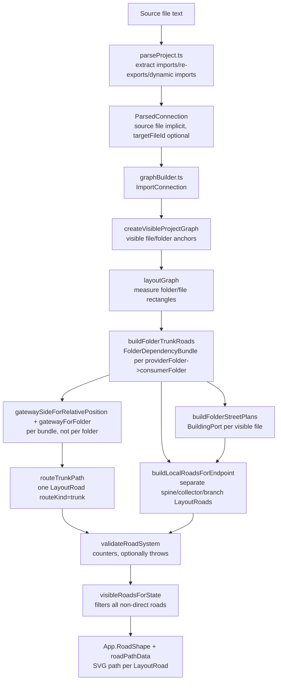
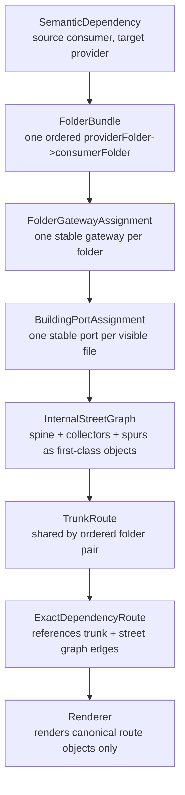

# Routing Diagnosis

This document diagnoses the current dependency road implementation. It does not propose another visual patch and does not assume the current implementation matches the intended model.

Status: historical diagnosis. The final implementation is complete and documented in `docs/ROUTING_IMPLEMENTATION_COMPLETE.md`.

## Scope Inspected

Relevant files and responsibilities:

| File | Relevant code | Responsibility |
| --- | --- | --- |
| `src/analysis/parseProject.ts` | `extractImportDeclarations`, `extractReExports`, `extractDynamicImportsAndRequires`, `resolveConnection` | Parses imports/re-exports/dynamic imports and resolves them to parsed semantic connections. |
| `src/analysis/graphBuilder.ts` | `createConnections`, `populateReverseDependencies`, `calculateFolderMetrics` | Converts parsed connections into `ImportConnection`; stores importer as `sourceFileId` and imported provider as `targetFileId`. |
| `src/shared/graphTypes.ts` | `ProjectGraph`, `FolderNode`, `FileNode`, `ImportConnection` | Semantic graph data model. No route geometry lives here. |
| `src/graph/layout/elkLayout.ts` | `GraphNode`, `LayoutRoad`, `BuildingPort`, `FolderGateway`, `buildTownLayout`, `createVisibleProjectGraph`, `layoutGraph`, `measureFolder`, `buildFolderTrunkRoads`, `buildLocalRoadsForBundle`, `buildLocalRoadsForEndpoint`, `buildFolderStreetPlans`, `buildEndpointStreetRoute`, `routeTrunkPath`, `validateRoadSystem` | All layout measurement, current bundling, gateway assignment, building port assignment, route segment generation, and route validation. |
| `src/graph/layout/roadVisibility.ts` | `visibleRoadsForState`, `dedupeRoads` | Filters which `LayoutRoad`s are rendered for overview, selected file/folder/road, and show-all mode. |
| `src/webview/App.tsx` | layout effect, `RoadShape`, `LayoutDebugOverlay`, `RoadDebugPanel`, `roadState`, `connectedEntityIds` | Calls layout, renders folders/files/roads/debug overlays, controls selection state. |
| `src/webview/renderer/roadGeometry.ts` | `roadPathData`, `roadSegments` | Converts each `LayoutRoad.points` polyline to SVG path data. |
| `src/webview/styles/app.css` | `.road-group.*`, `.layout-debug-*` | Road/debug styling only. |
| `test/layout.test.ts` | layout and road assertions | Tests some invariants but accepts the current multi-road-per-dependency representation. |
| `test/roadGeometry.test.ts` | `roadPathData`, `roadSegments` tests | Verifies SVG path serialization and segment extraction. |

## Current Actual Pipeline



## Correct Target Pipeline



## End-to-End Trace: `src/auth/auth.service.ts` imports `src/users/user.service.ts`

`environment.ts -> auth.service.ts` is not present in the checked-in fixture. This trace uses the real fixture dependency in `test/fixtures/basic/src/auth/auth.service.ts`:

```ts
import { UserService } from "../users/user.service";
```

Trace generated from the current code with all folders expanded and `throwOnRoadPolicyViolation: false`.

| Step | Input | Output | Function | Coordinate space | Reused or recomputed | Invariant status |
| --- | --- | --- | --- | --- | --- | --- |
| 1. Parsed import | `auth.service.ts` import specifier `"../users/user.service"` | `ParsedConnection` with `targetFileId: "src/users/user.service.ts"`, `type: "runtime"`, `sourceLine: 1` | `extractImportDeclarations` -> `resolveConnection` | No geometry | Semantic only | OK |
| 2. Semantic dependency object | Parsed connection plus parsed file id | `ImportConnection.id: "src/auth/auth.service.ts::src/users/user.service.ts::runtime::1::0::UserService:UserService"` | `createConnections` | No geometry | Stored in `ProjectGraph.connections` | OK |
| 3. Provider/consumer assignment | `sourceFileId = "src/auth/auth.service.ts"`, `targetFileId = "src/users/user.service.ts"` | Provider file is `targetFileId`; consumer file is `sourceFileId` | `buildFolderTrunkRoads` | No geometry | Recomputed from `ImportConnection` every layout | OK |
| 4. Folder bundle assignment | Provider file folder `src/users`; consumer file folder `src/auth` | Bundle key `src/users->src/auth`; trunk id `trunk:src/users->src/auth` | `renderedFolderIdForFile`, `addBundleDependency`, `bundleKey` | No geometry | Recomputed every layout | OK for this dependency; not a stable model object |
| 5. Provider building port | Provider file rect `{ x: 592, y: 780, width: 96, height: 110 }` | `BuildingPort { fileId: "src/users/user.service.ts", side: "left", x: 592, y: 835 }` | `buildFolderStreetPlan`, `buildingPortForSide` | World coordinates, layout-node rectangle | Stored in `layout.buildingPorts` for this layout only | Partially OK; it uses layout bounds, not actual visible building bounds |
| 6. Provider collector | Provider collector lane from file column | `collector:provider...` points `[ { x: 570, y: 835 }, { x: 570, y: 758 } ]` | `buildEndpointStreetRoute`, `mergeCollectorPath` | World coordinates | Recomputed per bundle endpoint | Violates target model: collector is a `LayoutRoad`, not a first-class reusable street object |
| 7. Provider folder gateway | Provider folder rect `{ x: 536, y: 676, width: 240, height: 270 }`; consumer folder to upper-left | `FolderGateway { folderId: "src/users", side: "left", x: 536, y: 758 }` | `gatewaySideForRelativePosition`, `gatewayForFolder` | World coordinates | Recomputed per bundle | Violates hard invariant 3 globally: a folder can get different gateways for different target folders |
| 8. Folder trunk | Provider gateway and consumer gateway | `trunk:src/users->src/auth` points `[ { x: 536, y: 758 }, { x: 512, y: 758 }, { x: 512, y: 434 }, { x: 488, y: 434 } ]` | `routeTrunkPath` | World coordinates | Recomputed per bundle | OK for this pair; one trunk for this ordered pair |
| 9. Consumer folder gateway | Consumer folder rect `{ x: 136, y: 350, width: 352, height: 270 }`; provider folder to lower-right | `FolderGateway { folderId: "src/auth", side: "right", x: 488, y: 434 }` | `oppositePort`, `gatewayForFolder` | World coordinates | Recomputed per bundle | Violates hard invariant 3 globally for folders with multiple external pairs |
| 10. Consumer collector | Consumer collector lane from file column | `collector:consumer...` points `[ { x: 172, y: 434 }, { x: 172, y: 509 } ]` | `buildEndpointStreetRoute`, `mergeCollectorPath` | World coordinates | Recomputed per bundle endpoint | Not first-class; generated independently for the bundle |
| 11. Consumer building port | Consumer file rect `{ x: 192, y: 454, width: 96, height: 110 }` | `BuildingPort { fileId: "src/auth/auth.service.ts", side: "left", x: 192, y: 509 }` | `buildFolderStreetPlan`, `buildingPortForSide` | World coordinates, layout-node rectangle | Stored in `layout.buildingPorts` for this layout only | Partially OK; branch uses this exact point, but it is not tied to rendered building art |
| 12. Final rendered geometry | Seven `LayoutRoad`s containing this one connection id | SVG paths: one trunk, two spines, two collectors, two branches | `visibleRoadsForState`, `RoadShape`, `roadPathData` | SVG world/viewBox coordinates | Rendered independently per `LayoutRoad` | Violates intended "exact route" model: one semantic dependency is not a canonical route referencing street edges; it becomes multiple rendered road records |

Observed debug counters for this fixture:

```json
{
  "semanticFileDependencyCount": 7,
  "visibleFileCount": 8,
  "filePortCount": 8,
  "filesWithInvalidMultipleEntrances": 0,
  "generatedFolderBundleCount": 4,
  "renderedTrunkCount": 3,
  "rejectedTrunkCount": 1,
  "routesBypassingGateway": 0,
  "routesBypassingSpineOrCollector": 2,
  "buildingIntersectionCount": 0,
  "labelIntersectionCount": 0
}
```

The current implementation itself reports that accepted real fixture routes bypass spine/collector levels.

## Why Multiple Entrances Still Appear

### What is actually stored

Each visible file currently receives one `BuildingPort` in `layout.buildingPorts`:

- `buildFolderStreetPlans` groups visible files by parent folder.
- `buildFolderStreetPlan` creates `portsByFileId`.
- `buildFolderTrunkRoads` copies those ports into a single `Map<string, BuildingPort>`.

For the traced dependency:

- `src/users/user.service.ts` has one stored port: left `(592, 835)`.
- `src/auth/auth.service.ts` has one stored port: left `(192, 509)`.

### Where the stored port is used

`buildLocalRoadsForEndpoint` reads `input.buildingPorts.get(route.file.id)` and only emits a branch if it matches `route.port`. The branch gets `sourceBuildingPort` for provider endpoints and `targetBuildingPort` for consumer endpoints.

So, in the current main route data, branch roads do use the stored `BuildingPort`.

### Why it can still look like multiple entrances

The single stored port does not fully control what is visually interpreted as an entrance:

1. `BuildingPort` is computed from the full layout node rectangle via `gatewayPoint(file, side)`, not from `FileBuildingShape`'s visible building rectangle. `FileBuildingShape` draws its base rectangle at `x + 16` with width `width - 32`, plus an image with its own dimensions. A route that ends at the layout rectangle boundary can visually miss the building wall or appear to connect to a different part of the asset.

2. Roads are rendered after file buildings in `App.tsx`. That means local spines/collectors/branches can draw over buildings rather than underneath them. Even if only one branch endpoint equals the stored port, any overlapping road segment can visually read as another entrance.

3. `LayoutRoad.participantFileIds` includes both provider and consumer files even on trunk, spine, and collector roads. Selection highlighting can make non-branch roads associated with a selected file appear as if they are part of that file's entrance, even when they do not terminate at the file port.

4. `LayoutDebugOverlay` renders all `layout.roads` and all `layout.buildingPorts` when `layoutDebug` is enabled, independent of `visibleRoadsForState`. In debug mode there is an additional active road-rendering path that can overlay hidden or filtered roads.

5. The legacy `layoutGraph` edge router still contains `choosePort`, `portPoint`, `portOffset`, and `routeEdgesFromPositionedNodes`, which can create multiple side-specific ports with offsets. `buildTownLayout` currently passes `[]` for edges, so this is not active for the main town map, but it is still an active routing system for callers of `layoutGraph` and tests.

### Exact functions involved

| Function | Role in entrance problem |
| --- | --- |
| `buildFolderStreetPlan` | Assigns one port per visible file, but based only on column collector X and full layout bounds. |
| `buildingPortForSide` / `gatewayPoint` | Computes the coordinate on the layout node boundary, not on the visible building geometry. |
| `buildLocalRoadsForEndpoint` | Uses the stored port for branch endpoints. This part is structurally closer to correct. |
| `FileBuildingShape` | Draws visual building geometry inset from the layout rectangle, so the computed port and visible wall do not match. |
| `RoadShape` | Draws every visible `LayoutRoad` as an independent SVG path. |
| `LayoutDebugOverlay` | Draws all route points and ports in debug mode, independent of normal visibility. |
| `routeEdgesFromPositionedNodes`, `choosePort`, `portPoint`, `portOffset` | Legacy direct edge router that can compute multiple ports. Not used by `buildTownLayout` because edges are empty, but still present. |

## Why Internal Roads Are Meaningless

The current implementation has names for `spine`, `collector`, and `branch`, but it does not have a durable internal street graph.

### Current state

| Object | Current representation | Problem |
| --- | --- | --- |
| Folder gateway | `FolderGateway` attached to each trunk/local `LayoutRoad` | Assigned per folder pair, not one per folder. |
| Internal spine | `LayoutRoad` with `routeKind: "spine"` | Generated per bundle endpoint from active dependency routes. Not a first-class folder street object. |
| Collector | `LayoutRoad` with `routeKind: "collector"` | Generated per bundle endpoint and collector id. Not stored as reusable lane geometry. |
| Spur | `LayoutRoad` with `routeKind: "branch"` | Uses building port, but exists as a separate rendered route object. |
| Exact dependency route | None | A semantic dependency is represented by several independent `LayoutRoad`s sharing `connectionIds`, not one route referencing canonical street edges. |

### Precise causes of long vertical/horizontal lines

1. `mergeSpinePath` collapses all endpoint route spine paths into one line per bundle endpoint. For left/right gateways this creates a horizontal line from the gateway to the min/max collector join. For top/bottom gateways this creates a vertical line from the gateway to min/max file port Y. This is mathematically a spanning segment, not a designed street in reserved space.

2. `mergeCollectorPath` collapses all collector paths into one vertical span from `minY` to `maxY` at `collectorX`. When several files in a column participate, this creates a long vertical line through the column lane. It is named "collector", but it is still generated from current dependency endpoints rather than from a folder street plan.

3. `collectorXForColumn` always places a collector at `minFileX - horizontalGap / 2`, clamped into the folder. This means all columns tend to get left-side collectors. It does not choose row collectors when that would be more natural, and it does not reserve lanes in the measurement model.

4. `measureFolder` reserves general padding and gaps, but it does not explicitly reserve a gateway lane, spine lane, collector lanes, label-safe areas, or nested-folder exclusion corridors. The router later assumes these lanes exist.

5. `buildEndpointStreetRoute` derives `spinePath`, `collectorPath`, and `spurPath` independently for each file, then merges them. This is route-first logic disguised as street-first logic.

6. The same folder can receive different gateways for different folder pairs because `gatewaySideForRelativePosition(providerFolder, consumerFolder)` is called per bundle. That means the internal "spine" direction can change per dependency pair for the same folder.

7. All route coordinates are world coordinates. The `layoutDebug` fields record local coordinates, but street generation uses world-space `folder.x`, `file.x`, and gateway points. That is consistent enough to render, but there is no typed distinction preventing local/world coordinate mixing in future changes.

## Duplicate Routing Systems

Active or present road-rendering/routing paths:

| System | Where | Active conditions | Status |
| --- | --- | --- | --- |
| Semantic parser/graph roads | `parseProject.ts`, `graphBuilder.ts` | Always active when analyzing a workspace | Semantic only; not a renderer. |
| Legacy direct file/folder edge router | `layoutGraph`, `routeEdgesFromPositionedNodes`, `choosePort`, `portPoint`, `routeBetweenPorts` in `elkLayout.ts` | Active for any caller that passes edges to `layoutGraph`; inactive in `buildTownLayout` because it passes `[]` | Legacy routing system still present. |
| Folder trunk router | `buildFolderTrunkRoads`, `routeTrunkPath` | Active in `buildTownLayout` when layout has no warnings and dependency crosses rendered folders | Main production route path. |
| Local spine renderer | `buildLocalRoadsForEndpoint` emits `routeKind: "spine"` | Active for expanded endpoint folders with participating visible files | Main production route path. |
| Local collector renderer | `buildLocalRoadsForEndpoint` emits `routeKind: "collector"` | Active for expanded endpoint folders with participating visible files | Main production route path. |
| Local branch/spur renderer | `buildLocalRoadsForEndpoint` emits `routeKind: "branch"` | Active for expanded endpoint folders with participating visible files | Main production route path. |
| Visibility selector | `visibleRoadsForState` | Active for all normal rendering; currently allows all non-`direct` roads | Can render trunk + local roads simultaneously. |
| Normal SVG road renderer | `App.tsx` `RoadShape` | Active when `hasCompleteLayout` and `renderedRoads` exists | Main renderer. |
| Debug route renderer | `LayoutDebugOverlay` | Active when `import.meta.env.DEV` and URL has `layoutDebug` | Draws all roads regardless of visibility filter. |
| Fallback layout edge renderer | `layoutGraph` fallback edges | Active for direct `layoutGraph` callers if layout warnings occur; not active in `buildTownLayout` roads because `buildTownLayout` returns no roads when warnings exist | Present but not normal production map path. |

No separate Canvas renderer was found. The normal renderer is SVG.

## Problem Classification

| Issue | Classification | Evidence | Priority |
| --- | --- | --- | --- |
| Folder gateway is assigned per bundle, not per folder | Incorrect data model | `gatewaySideForRelativePosition` and `gatewayForFolder` are called inside the bundle loop | Critical |
| Internal street graph is not first-class | Incorrect data model | Spines/collectors are `LayoutRoad`s generated from dependency routes, not reusable `FolderStreetPlan` geometry objects exposed to route construction | Critical |
| Exact dependency route object does not exist | Incorrect data model | One dependency appears in seven `LayoutRoad`s in the trace | Critical |
| Street generation is route-first, not street-first | Incorrect algorithm | `buildEndpointStreetRoute` derives paths per file and `mergeSpinePath`/`mergeCollectorPath` merge after routing | Critical |
| Layout does not reserve explicit routing lanes | Incorrect algorithm | `measureFolder` reserves padding/gaps only; no spine/collector/header-safe lane model | Critical |
| Same folder can have multiple gateway sides | Missing invariant | No `Map<folderId, FolderGateway>` as authoritative assignment | Critical |
| Single building port is only per current layout, not semantic/stable | Missing invariant | `BuildingPort` is derived from current visible layout and collector placement | High |
| Port coordinate is based on layout node, not visible building wall | Incorrect coordinate system | `buildingPortForSide` uses `gatewayPoint(file, side)`; `FileBuildingShape` draws insets | High |
| Roads render after buildings | Visual styling/rendering order | App renders files first, then roads | Medium structurally, high visually |
| Legacy direct edge router still exists | Duplicate renderer/router | `routeEdgesFromPositionedNodes` still active for `layoutGraph` callers | Medium |
| Visibility renders all non-direct roads by default | Incorrect algorithm/visibility model | `visibleRoadsForState` filters only `routeKind !== "direct"` | Medium |
| Validation can be disabled in webview | Missing validation in production | `throwOnRoadPolicyViolation: false` in `App.tsx` layout call | Medium |
| Validation checks counters after generation, not before rendering canonical routes | Missing invariant | `validateRoadSystem` does not prevent non-throwing webview render | Medium |
| Semantic dependency data is copied into every road segment | Incorrect data model | `createLayoutRoad` stores `dependencies`, `connectionIds`, `participantFileIds` on trunk/spine/collector/branch | Medium |

## Primary Root Cause

The primary root cause is that the implementation still treats route segments as rendered road objects instead of modeling the road network as stable semantic infrastructure.

The intended model needs:

1. stable folder gateways,
2. stable building ports,
3. stable folder-internal street graph edges,
4. stable shared trunks,
5. exact dependency routes that reference those objects.

The current model instead creates `LayoutRoad` records for trunk, spine, collector, and branch directly from each folder dependency bundle. That means dependency routing, network construction, geometry, visibility, highlighting, and rendering are all collapsed into one mutable structure.

## Is the Current Algorithm Salvageable?

The current algorithm should be partially replaced, leaning toward a complete replacement of routing internals.

The parser, semantic graph, folder/file layout measurement, and SVG path rendering can be retained. The routing layer from `buildFolderTrunkRoads` through local road generation should not be repaired incrementally. It has the wrong architecture: it creates road-looking polylines from dependencies rather than creating a street graph first and routing dependencies over it.

## Recommended Replacement Strategy

Use the smallest coherent replacement that separates semantic dependencies from route geometry:

1. Keep `ProjectGraph`, `ImportConnection`, `FolderNode`, and `FileNode`.
2. Keep folder/file layout measurement only as rectangle input.
3. Replace `buildFolderTrunkRoads`, `buildLocalRoadsForBundle`, `buildLocalRoadsForEndpoint`, `buildFolderStreetPlans`, `mergeSpinePath`, and `mergeCollectorPath`.
4. Introduce an explicit `RoutingPlan` with:
   - `folderGateways: Map<folderId, FolderGateway>`
   - `buildingPorts: Map<fileId, BuildingPort>`
   - `internalStreetGraphs: Map<folderId, InternalStreetGraph>`
   - `trunks: Map<providerFolderId->consumerFolderId, TrunkRoute>`
   - `dependencyRoutes: ExactDependencyRoute[]`
5. Render only canonical road infrastructure and selected/visible exact routes from this plan.

## Sequential Replacement Plan

### Step 1: Freeze semantic direction tests

- Files to change: `test/layout.test.ts` or a new `test/routingPlan.test.ts`.
- Old code to remove/disable: none.
- New data structures: none yet.
- Tests required:
  - `ImportConnection.sourceFileId` is consumer/importer.
  - `ImportConnection.targetFileId` is provider/imported file.
  - Folder bundle key is provider folder -> consumer folder.
- Acceptance condition: semantic direction can be validated without reading rendered road geometry.

### Step 2: Add routing data model only

- Files to change: `src/graph/layout/elkLayout.ts` or a new `src/graph/layout/routingPlan.ts`.
- Old code to remove/disable: none initially.
- New data structures:
  - `RoutingPlan`
  - `FolderGatewayAssignment`
  - `InternalStreetGraph`
  - `StreetEdge`
  - `TrunkRoute`
  - `ExactDependencyRoute`
- Tests required:
  - every visible file has exactly one `BuildingPort`.
  - every expanded folder with external dependencies has exactly one `FolderGateway`.
- Acceptance condition: the plan can be built and inspected without rendering any roads.

### Step 3: Replace gateway assignment

- Files to change: new routing planner file plus `elkLayout.ts` call site.
- Old code to remove or disable:
  - per-bundle calls to `gatewaySideForRelativePosition`
  - per-bundle `gatewayForFolder` ownership
- New data structures:
  - `folderGateways: Map<string, FolderGateway>`
- Tests required:
  - a folder involved in multiple incoming/outgoing bundles keeps the same gateway coordinate.
  - trunks only start/end at assigned folder gateways.
- Acceptance condition: hard invariants 3 and 4 pass before local roads exist.

### Step 4: Replace building port assignment

- Files to change: routing planner file, possibly `App.tsx` debug overlay after planner exists.
- Old code to remove or disable:
  - `buildFolderStreetPlan` port assignment based on current collector X.
  - fallback left ports for files outside folder street plans.
- New data structures:
  - `buildingPorts: Map<string, BuildingPort>` as authoritative planner output.
- Tests required:
  - every visible file has one port.
  - every dependency route endpoint that touches a file equals the stored port.
  - no route object can carry an ad hoc building endpoint.
- Acceptance condition: hard invariants 1 and 2 pass without relying on post-hoc route validation.

### Step 5: Build real internal street graphs

- Files to change: routing planner file and layout measurement if lane reservation is needed.
- Old code to remove or disable:
  - `buildEndpointStreetRoute`
  - `mergeSpinePath`
  - `mergeCollectorPath`
  - `collectorXForColumn` as the whole collector model
- New data structures:
  - `InternalStreetGraph`
  - `StreetEdge` with `kind: "spine" | "collector" | "spur"`
  - row/column lane metadata
- Tests required:
  - each expanded folder with active external dependencies has one spine from gateway inward.
  - collectors align with file rows/columns.
  - spurs are short and terminate at stored ports.
  - street edges avoid building, label, and nested-folder rectangles.
- Acceptance condition: hard invariants 6, 8, and 9 pass at the street graph level.

### Step 6: Replace trunk routing

- Files to change: routing planner file.
- Old code to remove or disable:
  - `routeTrunkPath` if it cannot consume stable gateway assignments.
- New data structures:
  - `trunks: Map<string, TrunkRoute>`
- Tests required:
  - one trunk per ordered providerFolder->consumerFolder pair.
  - opposite directions produce separate trunks.
  - trunks do not intersect unrelated folder interiors/buildings.
- Acceptance condition: hard invariants 4, 5, 7, 8, and 9 pass.

### Step 7: Add exact dependency routes

- Files to change: routing planner file, `roadVisibility.ts`.
- Old code to remove or disable:
  - copying full dependency metadata into every infrastructure segment.
  - using `LayoutRoad` as both route segment and semantic dependency route.
- New data structures:
  - `ExactDependencyRoute` referencing provider port, provider street edge ids, trunk id, consumer street edge ids, consumer port.
- Tests required:
  - a dependency cannot skip gateway/spine/collector/spur.
  - selection mode shows routes by referencing canonical edges, not by generating alternate geometry.
- Acceptance condition: hard invariant 10 passes; semantic data remains separate from rendered geometry.

### Step 8: Replace renderer inputs

- Files to change: `src/webview/App.tsx`, `src/webview/renderer/roadGeometry.ts`, possibly `src/graph/layout/roadVisibility.ts`.
- Old code to remove or disable:
  - rendering every `LayoutRoad` as a standalone dependency road.
  - debug overlay rendering all hidden roads as if they were route geometry.
- New data structures:
  - renderer view models derived from `RoutingPlan`.
- Tests required:
  - no direct file-to-file road renderer is active.
  - debug renderer is visually and semantically separate from normal road renderer.
  - selected-file mode does not compute new endpoints.
- Acceptance condition: only canonical routing-plan geometry is rendered.

### Step 9: Remove legacy direct router or isolate it

- Files to change: `src/graph/layout/elkLayout.ts`, tests that call `layoutGraph` with edges.
- Old code to remove or isolate:
  - `routeEdgesFromPositionedNodes`
  - `choosePort`
  - `portPoint`
  - `portOffset`
  - `routeBetweenPorts`
- New data structures: none if removed; otherwise a clearly named legacy test-only route output.
- Tests required:
  - production town layout never calls legacy direct routing.
  - no production renderer consumes legacy direct routes.
- Acceptance condition: duplicate routing systems are gone or explicitly isolated from dependency roads.
